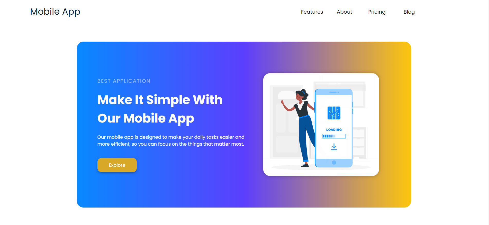

# MobileApp Project

Welcome to the repository for the MobileApp project. This project represents my second endeavor, focusing on creating a high-performance mobile application optimized for a seamless user experience across all devices. This README provides an overview of the project, its features and other relevant information.

## Features

1. Device Optimization: The app has been meticulously designed and developed to provide optimal performance on various devices, including smartphones and tablets. 

2. Responsive Design: The user interface dynamically adapts to different screen sizes and orientations, ensuring a consistent and visually pleasing layout.

3. Smooth Navigation: The app offers intuitive navigation, allowing users to effortlessly explore its functionalities and content.

4. Efficient Resource Usage: Careful consideration has been given to resource utilization, resulting in a minimal footprint and swift loading times.

## Screenshot

## Live Preview

You can check my page [HERE](https://chrissv2.github.io/MobileApp/)

## Technologies

